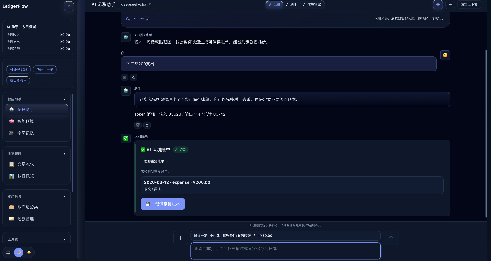
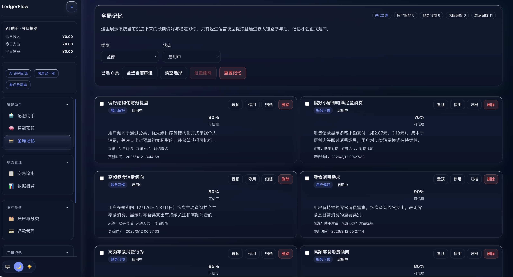
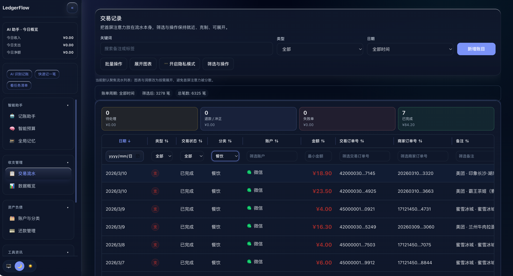
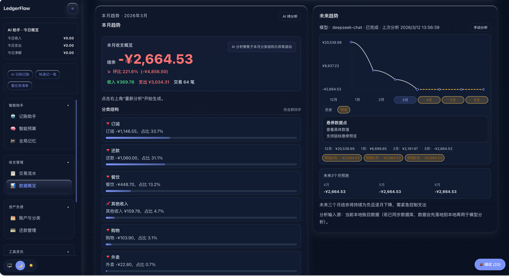

# LedgerFlow

> AI-native personal finance frontend for fast bookkeeping, debt tracking, repayment management, budgeting, and audit-friendly analysis.

⚠️ **测试版声明**：本项目目前处于测试初期阶段，由于暂时只有我一个人开发，存在部分 bug 和不完善之处。我们正在快速迭代更新中，欢迎反馈问题和需求，及时关注项目更新！目前更新会非常频繁，后续会增加大量新功能以及优化效果，我们的目标是成为行业最强 AI 工具！

<table>
  <tr>
    <td></td>
    <td></td>
  </tr>
  <tr>
    <td></td>
    <td></td>
  </tr>
</table>

LedgerFlow 是一个围绕 **“记得快、看得清、能追溯、可优化”** 设计的个人财务前端应用。
它强调本地优先、可审计的数据结构，以及面向真实日常使用场景的效率：
- 快速录入交易
- 智能识别与分类
- 预算执行追踪
- 负债 / 还款闭环管理
- 面向月度复盘与异常发现的可视化分析

---

## Live Demo

测试 Demo：
- https://ledgerflow.up.railway.app

---

## Core Features

- **Transactions**：收入/支出/预算/还款统一建模，筛选排序批量操作，退款/冲正关联
- **Assistant**：自然语言财务问答、账单/截图识别、AI 辅助分类与分析；支持自定义 OpenAI-compatible 接口；支持 **AI 信贷管家**（识别结果可带去还款管理预填）
- **Repayment Management**：负债列表 + 还款台账，最低还款/期供计算，登记还款联动回写
- **Smart Budget**：预算方案、分类级预算跟踪、超预算提醒与执行反馈
- **Dashboard**：净资产/本月结余总览、趋势与分类结构、异常提醒
- **WebDAV**：支持备份上传/下载、账单附件上传（可选）

---

## 快速开始（推荐：Docker 部署）

### Docker Compose

仓库已提供 `docker-compose.yml`，默认直接启动即可：

```bash
docker compose up -d
```

对应配置写法如下（与你仓库里的 compose 保持一致）：

```yaml
services:
  ledgerflow-web:
    image: 34v0wphix/ledgerflow:latest
    container_name: ledgerflow-web
    ports:
      - "${LEDGERFLOW_PORT:-8080}:80"
    restart: unless-stopped
```

访问：

```text
http://localhost:8080
```

可选：自定义端口（例如 18080）：

```bash
LEDGERFLOW_PORT=18080 docker compose up -d
```

升级到最新镜像：

```bash
docker compose pull
docker compose up -d
```

### Docker Run

```bash
docker run -d --name ledgerflow-web -p 8080:80 34v0wphix/ledgerflow:latest
```

---

## 可选配置

### AI Configuration（可选）

应用支持接入 OpenAI-compatible 接口用于：
- 助手问答
- 交易识别与分类
- 预算建议
- 财务趋势分析

通常需要配置：
- Base URL
- API Key
- Model

如果未配置 AI，基础记账、预算、交易管理等本地能力仍可使用。

### WebDAV Configuration（可选）

LedgerFlow 目前支持通过 WebDAV 做两类能力：
1. 备份上传 / 下载
2. 账单详情附件上传

说明：
- 仅允许合法 HTTPS 地址
- 拒绝 localhost / 内网地址
- 未配置完成时，相关入口会禁用或提示不可用

---

## 本地开发（可选：仅在你要改代码时需要）

> 这里保留最短的开发方式，避免 README 过长。

Requirements：
- Node.js 20+
- npm 10+

```bash
npm install
npm run dev
```

常用命令：

```bash
npm run test
npm run build
npm run lint
```

---

## License

This repository is released under **CC BY-NC-SA 4.0**.
See:
- `LICENSE`
- `LICENSES/CC-BY-NC-SA-4.0.md`
