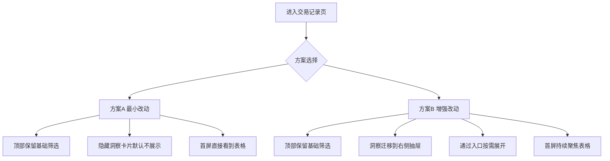

# 交易记录页聚焦流水列表 A/B 方案与验收清单（2026-02-28）

## 1. 目标

将交易记录页从多信息并列改为流水列表优先，降低视觉干扰，提升以下主路径效率：

1. 看流水
2. 搜索筛选
3. 批量操作
4. 进入详情编辑

当前主要结构见 [`TransactionsPage.tsx`](src/pages/transactions/TransactionsPage.tsx) 与 [`TransactionFilters.tsx`](src/features/transactions/components/TransactionFilters.tsx)。

---

## 2. 当前问题摘要

1. 流水表格上方的洞察信息块占据较高首屏空间，分散注意力
2. 高级筛选、标签云、分组卡片与列表主任务并列，信息密度偏高
3. 用户进入页面后，视觉焦点不够直接落在表格

---

## 3. 信息架构对比

---

## 4. 方案 A 最小改动版

### 4.1 设计原则

- 默认只服务流水查看任务
- 保留现有能力，不改数据逻辑
- 以最小代码变更完成体验转向

### 4.2 页面结构

1. 保留顶部筛选区：关键词、类型、日期、新增账目、筛选与操作
2. 保留提示条：导入结果、AI 重分类进度
3. 默认不渲染洞察区块 [`transaction-insight-panel`](src/pages/transactions/TransactionsPage.tsx)
4. 表格区上移，成为首屏主体

### 4.3 交互策略

- 增加一个轻量入口按钮 如 交易洞察（可选）
- 点击后在当前页下方展开原洞察区 或跳到二级页面（后续）

### 4.4 影响面

- 主要改动文件：[`TransactionsPage.tsx`](src/pages/transactions/TransactionsPage.tsx)、[`global.css`](src/app/styles/global.css)
- 不涉及状态模型与数据结构变更

---

## 5. 方案 B 增强版

### 5.1 设计原则

- 保持交易页持续聚焦流水
- 将分析能力改为按需访问
- 减少上下滚动与上下文跳转

### 5.2 页面结构

1. 顶部与表格区域同方案 A
2. 洞察内容迁移到右侧抽屉（含月度汇总、高级筛选、标签云、分组卡片）
3. 在筛选区放置 洞察 按钮打开抽屉

### 5.3 交互策略

- 抽屉默认关闭，用户主动打开
- 抽屉支持关闭与记忆状态（可选）
- 表格操作不中断，抽屉作为辅助层

### 5.4 影响面

- 主要改动文件：[`TransactionsPage.tsx`](src/pages/transactions/TransactionsPage.tsx)、[`global.css`](src/app/styles/global.css)
- 可能新增组件文件：如 [`TransactionInsightDrawer.tsx`](src/features/transactions/components/TransactionInsightDrawer.tsx)

---

## 6. A/B 方案对比与取舍

| 维度           | 方案 A 最小改动 | 方案 B 增强版 |
| -------------- | --------------- | ------------- |
| 首屏聚焦流水   | 高              | 高            |
| 实现复杂度     | 低              | 中            |
| 对现有代码扰动 | 低              | 中            |
| 洞察可达性     | 中              | 高            |
| 后续可扩展性   | 中              | 高            |

建议：先落地方案 A 验证主路径，再按反馈演进到方案 B。

---

## 7. 实施清单（供代码模式执行）

### 7.1 方案 A 实施清单

1. 在 [`TransactionsPage.tsx`](src/pages/transactions/TransactionsPage.tsx) 移除或条件渲染 [`transaction-insight-panel`](src/pages/transactions/TransactionsPage.tsx)
2. 调整页面区块顺序，确保 [`TransactionTable`](src/features/transactions/components/TransactionTable.tsx) 更靠前
3. 在 [`global.css`](src/app/styles/global.css) 收敛上方间距，优化首屏可视行数
4. 回归验证筛选、批量操作、导入提示、AI 重分类进度条

### 7.2 方案 B 实施清单

1. 提取洞察模块为独立组件（建议 [`TransactionInsightDrawer.tsx`](src/features/transactions/components/TransactionInsightDrawer.tsx)）
2. 在 [`TransactionsPage.tsx`](src/pages/transactions/TransactionsPage.tsx) 增加抽屉开关状态与入口按钮
3. 在 [`global.css`](src/app/styles/global.css) 新增抽屉样式与响应式规则
4. 验证抽屉开关不影响表格滚动、排序、筛选和批量动作

---

## 8. 验收清单

### 8.1 通用验收（A/B 都必须满足）

- [x] 首屏进入后无需滚动即可看到流水表头与至少 1 行数据 ✅
- [x] 筛选条件生效速度与结果正确性不下降 ✅
- [x] 批量选择与批量 AI 重分类流程正常 ✅
- [x] 导入结果提示与进度提示不遮挡关键操作 ✅
- [x] 页面在移动端不出现关键控件被挤压或不可点击 ✅

### 8.2 方案 A 专项验收

- [x] 洞察区默认不展示，页面视觉焦点集中在表格 ✅
- [ ] 若保留洞察入口，点击后可正常查看原洞察内容

### 8.3 方案 B 专项验收

- [ ] 洞察抽屉默认关闭，打开关闭稳定
- [ ] 抽屉内筛选操作与主表状态同步正确
- [ ] 抽屉开关不引发表格宽度抖动与布局跳变

---

## 9. 风险与规避

1. 风险：隐藏洞察后用户找不到高级筛选
   - 规避：在筛选按钮旁提供明确入口文案
2. 风险：抽屉方案造成状态分散
   - 规避：统一状态留在 [`TransactionsPage.tsx`](src/pages/transactions/TransactionsPage.tsx)，抽屉仅做视图层
3. 风险：样式调整影响暗色主题一致性
   - 规避：复用现有变量与面板样式约定来自 [`global.css`](src/app/styles/global.css)
